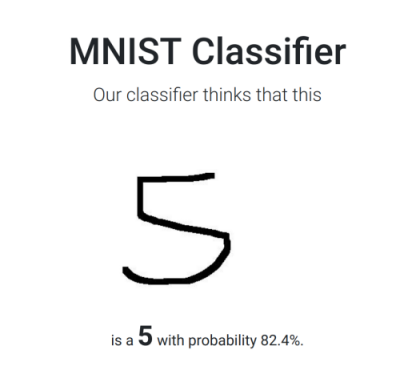

# OnlineMNISTClassifier

This small project runs a website via python flask server. The user can upload an image of a handwritten or otherwise digit which is then classified by a TensorFlow model.

## MNIST

`static/model` contains a MNIST classifier trained in tensorflow using the estimator API

## Installation

To install the package on your machine, set up a new virtual environment, e.g. a conda environment. Clone the repository to the directory of your choice

```bash
git clone https://github.com/Marsll/WebDevProject.git
```

Then, **inside the directory** you can install it by

```bash
python setup.py install
```

Lastly, you can run the flask server by running

```bash
export FLASK_APP=FlaskMNISTClassifier/app.py
flask run
```

again **inside the directory**. In your browser, you should then see the application on [http://127.0.0.1:5000/](http://127.0.0.1:5000/).
